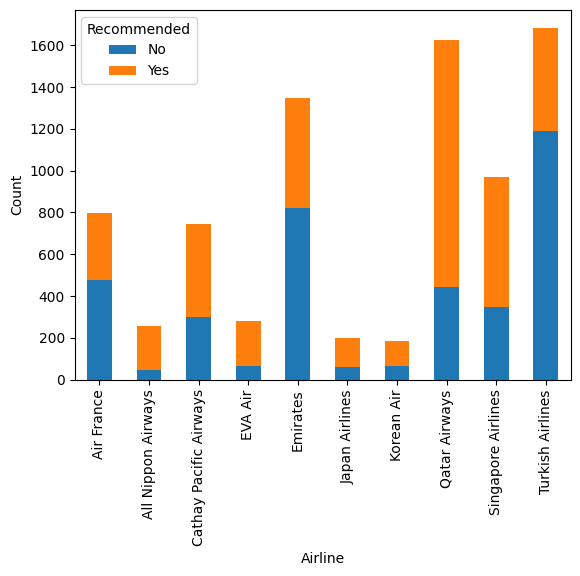
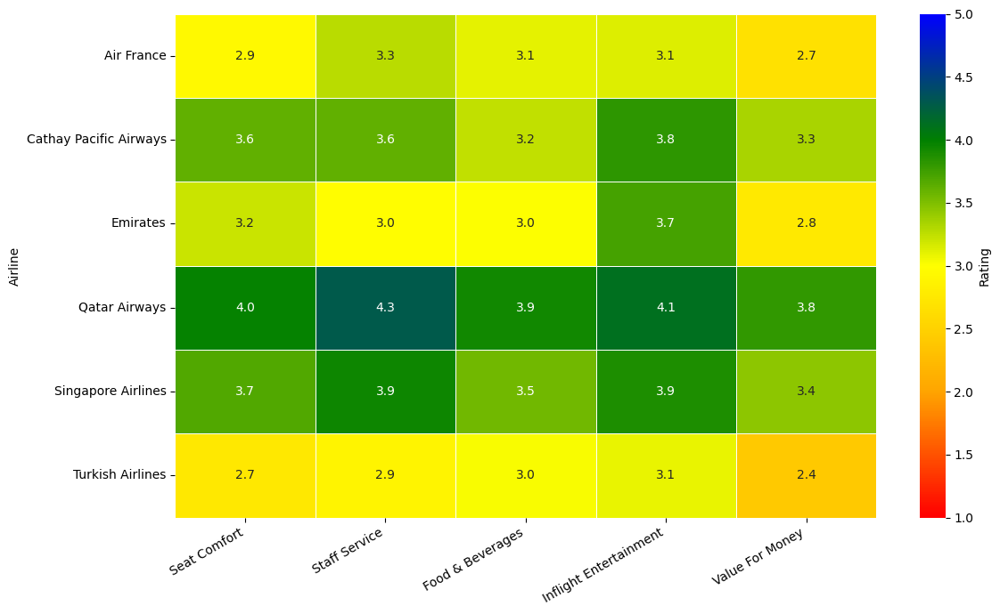

# ✈️ Airline Passenger Satisfaction Analysis

## 📌 Overview
This project analyzes airline passenger data to identify key factors influencing customer satisfaction. Using Python, the dataset was cleaned, explored, and visualized to uncover meaningful insights into passenger experience.

---

## 🎯 Objective
- Analyze passenger satisfaction across different airline classes  
- Understand factors affecting customer recommendations  
- Identify patterns in airline performance using data analysis  

---

## 🛠️ Tools & Technologies
- Python  
- Pandas  
- NumPy  
- Matplotlib  
- Seaborn  

---

## 📊 Visualizations

**Airline Class Comparison**  

**Recommendation Analysis (Stacked Bar Chart)**  

**Airline Performance Heatmap**  

---

## 📈 Key Insights
- Business and First-class passengers show higher satisfaction compared to Economy class  
- Customer recommendation is strongly influenced by service quality and overall experience  
- Heatmap analysis reveals strong relationships between service features and passenger satisfaction  
- Poor service and delays significantly reduce the likelihood of recommendation  

---

## 🔍 Analysis Highlights
- Performed data cleaning and preprocessing  
- Conducted exploratory data analysis (EDA)  
- Visualized relationships using bar chart, stacked chart, and heatmap 

---

## 📁 Dataset
The dataset used in this project is included in the repository.

---

## 📃 Conclusion
This project demonstrates how Python-based data analysis can uncover meaningful insights into customer satisfaction and support better decision-making in the airline industry.

---
